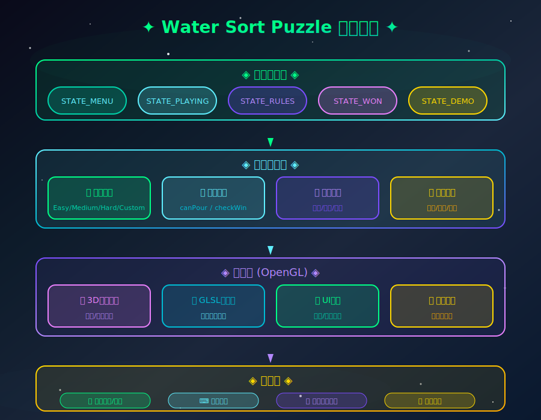
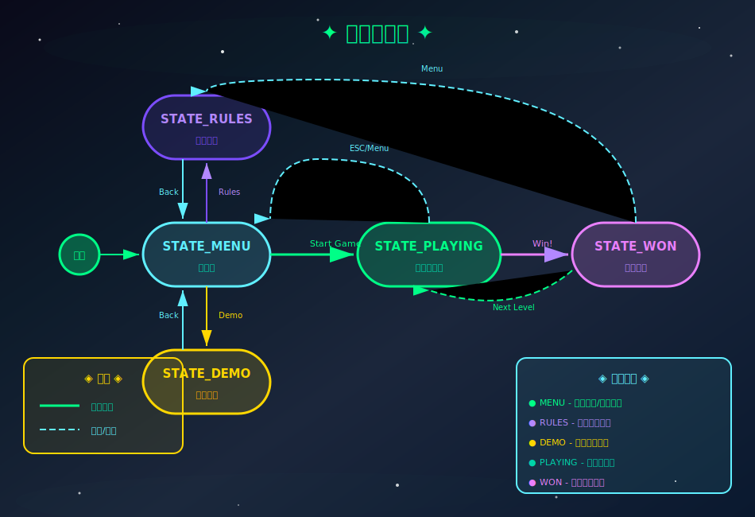
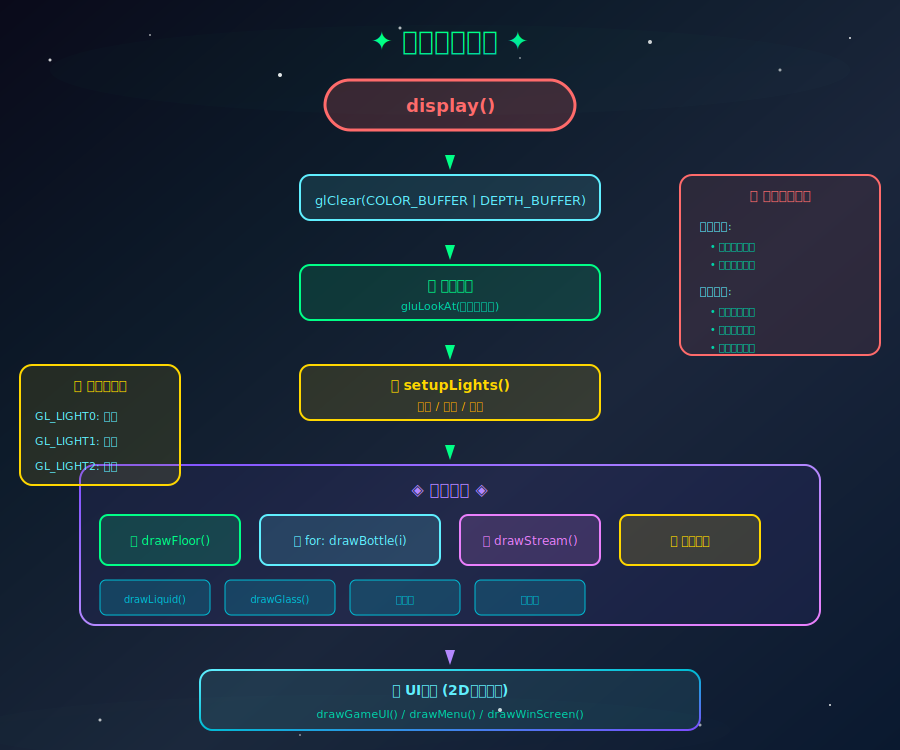
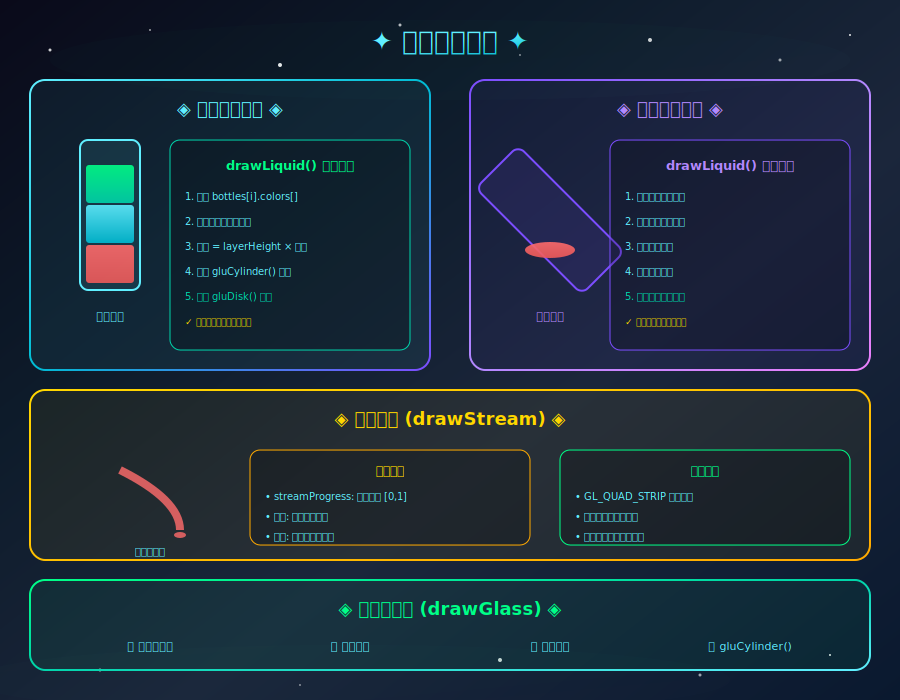
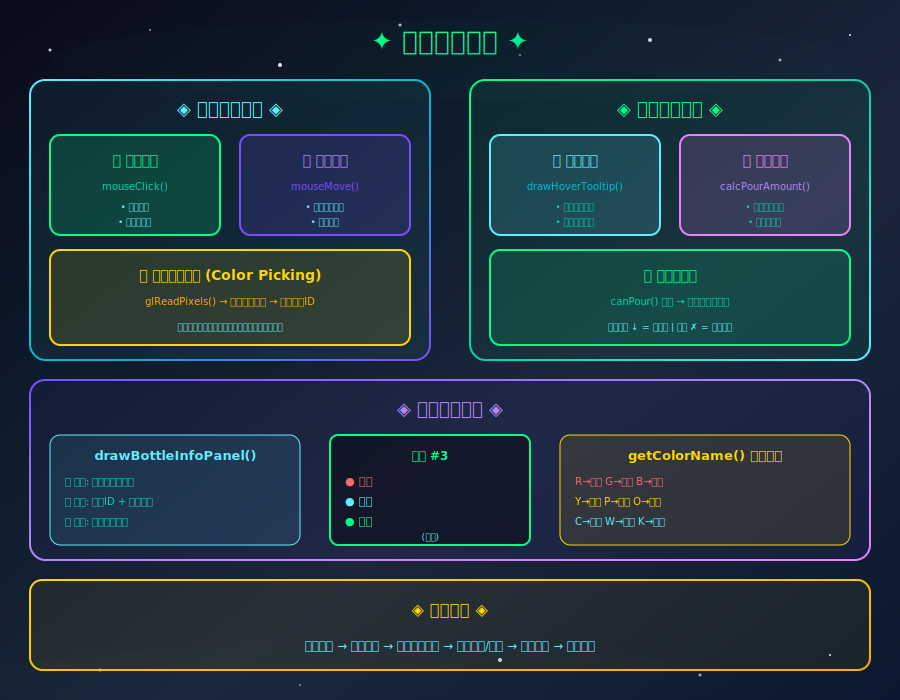
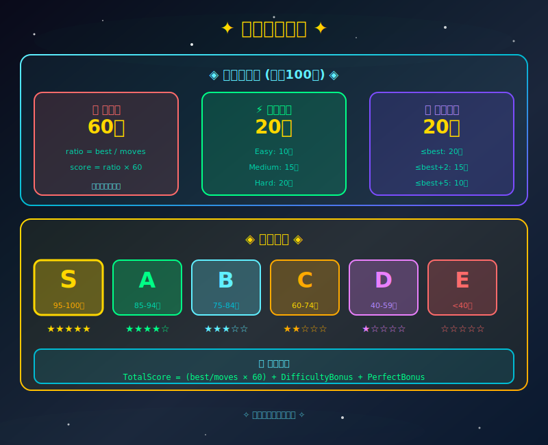
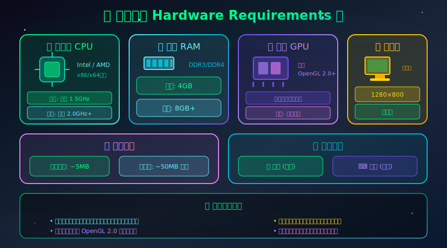
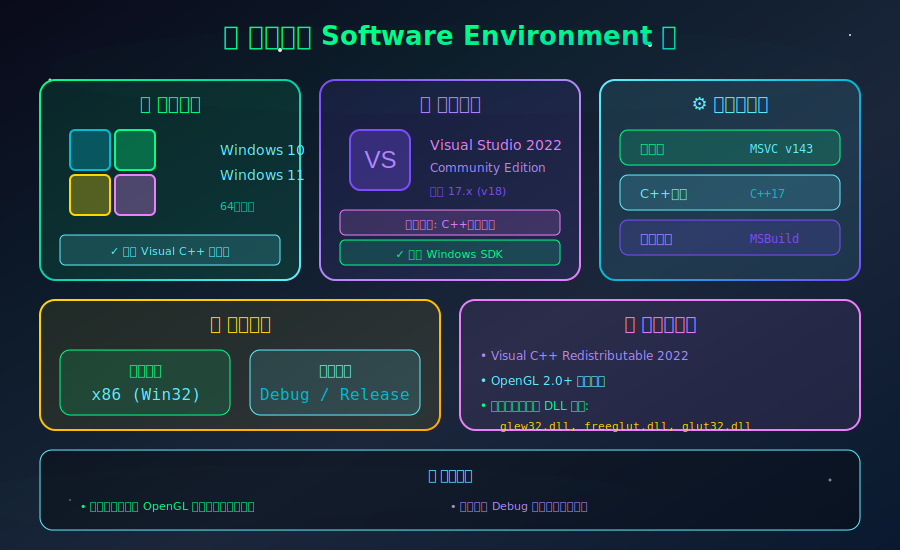
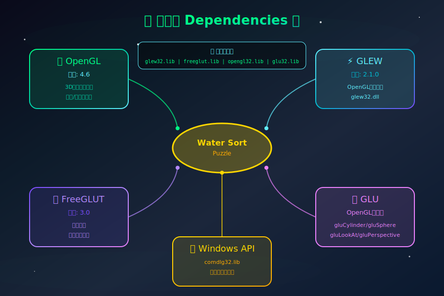
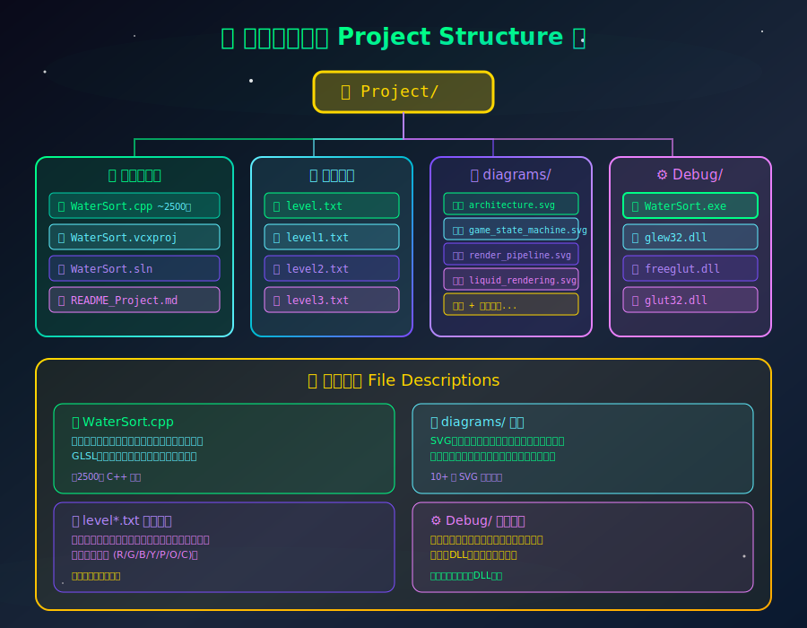

# Water Sort Puzzle - 项目介绍文档

## 一、项目概述

Water Sort Puzzle（液体分类益智游戏）是一款基于OpenGL的3D益智游戏。玩家需要通过点击瓶子，将不同颜色的液体倒入其他瓶子中，最终使每个瓶子只包含单一颜色的液体。

### 项目特色

- 3D渲染的玻璃瓶和液体效果
- 物理模拟的液体倾倒动画
- GLSL着色器增强的液体渲染
- 多难度关卡系统
- 自定义关卡文件导入
- 丰富的鼠标交互反馈
- 细腻的得分评判系统
- Demo演示模式

---

## 二、功能模块架构



**架构说明：**

- **状态管理层**：控制游戏的5种状态（菜单、游戏、规则、胜利、演示）
- **游戏核心层**：关卡管理、游戏逻辑、动画系统、得分系统
- **渲染层**：OpenGL 3D渲染、GLSL着色器、UI界面、光照系统
- **交互层**：鼠标点击/悬停、键盘控制、文件导入

---

## 三、详细功能模块

### 3.1 游戏状态机



**状态说明：**

- **STATE_MENU** - 主菜单，选择难度或加载自定义关卡
- **STATE_RULES** - 游戏规则说明界面
- **STATE_DEMO** - 自动演示模式
- **STATE_PLAYING** - 游戏进行中，玩家操作
- **STATE_WON** - 胜利界面，显示得分和评级

### 3.2 渲染管线



**渲染流程：**

1. `display()` - 主渲染函数入口
2. `glClear()` - 清除颜色和深度缓冲
3. `gluLookAt()` - 设置球面坐标相机
4. `setupLights()` - 配置三光源系统
5. `drawFloor()` - 绘制地面
6. `drawBottle()` × N - 循环绘制所有瓶子
7. `drawStream()` - 绘制倾倒液流（动画时）
8. `drawGameUI()` - 绘制2D界面
9. `glutSwapBuffers()` - 交换双缓冲

### 3.3 液体渲染系统



**渲染模式：**

- **直立状态** (tiltAngle < 1°): 分层绘制圆柱体，每层独立颜色
- **倾斜状态**: 液面在世界坐标中保持水平，体积守恒计算
- **液流渲染**: 贝塞尔曲线插值，动态宽度模拟重力效果

### 3.4 鼠标交互系统



**交互功能：**

- **悬停提示** - 显示瓶子编号和颜色层信息
- **高亮预览** - 选中源瓶后预览可倒入层数
- **可操作提示** - 绿色箭头(可倒入) / 红色X(不可倒入)
- **信息面板** - 左上角显示详细瓶子信息

---

## 四、核心算法

### 4.1 倾倒判断算法 (canPour)

```c
int canPour(int source, int target) {
    if (source == target) return 0;           // 不能倒给自己
    if (source < 0 || target < 0) return 0;   // 索引无效
    if (bottles[source].count == 0) return 0; // 源瓶为空
    if (bottles[target].count >= MAX_LAYERS) return 0; // 目标瓶已满
    return 1;  // 可以倾倒
}
```

### 4.2 倾倒数量计算 (calcPourAmount)

```c
int calcPourAmount(int source, int target) {
    if (!canPour(source, target)) return 0;
  
    int topColor = bottles[source].layers[count-1];
  
    // 计算源瓶顶部连续同色层数
    int sameColorCount = 0;
    for (int j = count-1; j >= 0 && bottles[source].layers[j] == topColor; j--)
        sameColorCount++;
  
    // 目标瓶剩余空间
    int space = MAX_LAYERS - bottles[target].count;
  
    // 如果目标瓶非空且顶部颜色不同，只能倒1层
    if (bottles[target].count > 0 && 
        bottles[target].layers[count-1] != topColor)
        return min(1, space);
  
    return min(sameColorCount, space);
}
```

### 4.3 胜利检测算法 (checkWin)

```c
int checkWin() {
    for (int i = 0; i < numBottles; i++) {
        if (bottles[i].count == 0) continue;  // 空瓶跳过
        if (bottles[i].count != MAX_LAYERS) return 0;  // 未满
      
        int baseColor = bottles[i].layers[0];
        for (int j = 1; j < MAX_LAYERS; j++)
            if (bottles[i].layers[j] != baseColor)
                return 0;  // 颜色不一致
    }
    return 1;  // 所有瓶子都是单色或空
}
```

### 4.4 倾倒动画状态机


**动画阶段说明：**

| Phase | 名称 | 动作                                   |
| ----- | ---- | -------------------------------------- |
| 0     | 准备 | 计算抬起高度、移动距离、倾倒方向       |
| 1     | 抬起 | offsetY增加，moveX变化，移动到目标上方 |
| 2     | 倾斜 | tiltAngle增加，瓶子开始倾斜            |
| 3     | 倾倒 | 绘制液流，源瓶减少，目标瓶增加         |
| 4     | 复位 | tiltAngle归零，回到原位，检测胜利      |

### 4.5 得分计算系统



**三维度评分（满分100分）：**

| 维度     | 满分 | 计算方式                            |
| -------- | ---- | ----------------------------------- |
| 效率分   | 60   | (最佳步数/实际步数) × 60           |
| 难度加成 | 20   | Easy=10, Medium=15, Hard=20         |
| 完美奖励 | 20   | ≤最佳=20, ≤最佳+2=15, ≤最佳+5=10 |

**评级系统：**

| 评级 | 分数范围 | 星级       |
| ---- | -------- | ---------- |
| S    | 95-100   | ★★★★★ |
| A    | 85-94    | ★★★★☆ |
| B    | 75-84    | ★★★☆☆ |
| C    | 60-74    | ★★☆☆☆ |
| D    | 40-59    | ★☆☆☆☆ |
| E    | 0-39     | ☆☆☆☆☆ |

### 4.6 鼠标拾取算法 (颜色拾取法)

```c
int pickBottle(int mouseX, int mouseY) {
    // 1. 清除缓冲区，关闭光照
    glClear(GL_COLOR_BUFFER_BIT | GL_DEPTH_BUFFER_BIT);
    glDisable(GL_LIGHTING);
  
    // 2. 为每个瓶子分配唯一颜色
    for (int i = 0; i < numBottles; i++) {
        int uniqueColor = (i+1) * 20;  // 灰度值: 20, 40, 60...
        glColor3ub(uniqueColor, uniqueColor, uniqueColor);
        drawBottleBoundingBox(i);
    }
  
    // 3. 读取鼠标位置的像素颜色
    unsigned char pixel[3];
    glReadPixels(mouseX, winH-mouseY, 1, 1, GL_RGB, GL_UNSIGNED_BYTE, pixel);
  
    // 4. 根据颜色反推瓶子索引
    int bottleIndex = pixel[0] / 20 - 1;
    return (bottleIndex >= 0 && bottleIndex < numBottles) ? bottleIndex : -1;
}
```

---

## 五、开发环境

### 5.1 硬件环境



**硬件要求说明：**

- 本游戏采用OpenGL进行3D渲染，对硬件要求较为宽松
- 核心要求是显卡需支持OpenGL 2.0以上版本（用于GLSL着色器）
- 大多数2010年后生产的电脑均可流畅运行
- 推荐使用独立显卡以获得更好的液体渲染效果和抗锯齿

| 项目   | 最低配置       | 推荐配置     |
| ------ | -------------- | ------------ |
| CPU    | 双核 1.5GHz    | 四核 2.0GHz+ |
| 内存   | 4GB RAM        | 8GB+ RAM     |
| 显卡   | 支持OpenGL 2.0 | 独立显卡     |
| 显示器 | 1280×800      | 1920×1080   |
| 存储   | 50MB           | 100MB        |

### 5.2 软件环境



**开发环境说明：**

- 使用Visual Studio 2022作为主要开发IDE，提供完整的C++开发工具链
- 编译器采用MSVC v143，支持C++17标准
- 项目配置为x86 (Win32)平台，确保最大兼容性
- Debug配置用于开发调试，Release配置用于发布

| 项目     | 版本/说明                            |
| -------- | ------------------------------------ |
| 操作系统 | Windows 10/11 (64位)                 |
| IDE      | Visual Studio 2022 Community Edition |
| 编译器   | MSVC v143 (C++17)                    |
| 构建系统 | MSBuild                              |
| 平台     | x86 (32位)                           |

### 5.3 依赖库



**依赖库说明：**

- **OpenGL**: 核心3D图形渲染API，提供顶点处理、光栅化、着色器支持
- **GLEW**: OpenGL Extension Wrangler，用于加载OpenGL扩展函数
- **FreeGLUT**: 跨平台窗口管理库，处理窗口创建、输入事件、定时器
- **GLU**: OpenGL工具库，提供便捷的几何体绘制和矩阵操作函数
- **Windows API**: 用于文件对话框等系统功能

| 库名称      | 版本  | 用途       | 文件             |
| ----------- | ----- | ---------- | ---------------- |
| OpenGL      | 4.6   | 3D图形渲染 | opengl32.lib     |
| GLEW        | 2.1.0 | 扩展加载   | glew32.lib/dll   |
| FreeGLUT    | 3.0   | 窗口管理   | freeglut.lib/dll |
| GLU         | -     | 工具函数   | glu32.lib        |
| Windows API | -     | 文件对话框 | comdlg32.lib     |

### 5.4 项目文件结构



**目录结构说明：**

- **WaterSort.cpp**: 主源代码文件，包含所有游戏逻辑（约2500行）
- **diagrams/**: SVG格式的架构图和流程图目录
- **Debug/**: 编译输出目录，包含可执行文件和DLL
- **level*.txt**: 关卡配置文件，支持自定义关卡

```
Project/
├── WaterSort.cpp          # 主源代码文件 (~2500行)
├── WaterSort.vcxproj      # Visual Studio项目文件
├── WaterSort.vcxproj.user # 用户配置
├── WaterSort.sln          # 解决方案文件
├── README_Project.md      # 项目文档
├── level.txt              # 示例关卡文件
├── level1.txt ~ level3.txt # 预设关卡
├── diagrams/              # SVG图表目录
│   ├── architecture.svg       # 系统架构图
│   ├── game_state_machine.svg # 游戏状态机图
│   ├── pour_animation.svg     # 倾倒动画状态机
│   ├── render_pipeline.svg    # 渲染管线流程图
│   ├── scoring_system.svg     # 得分评判系统图
│   ├── mouse_interaction.svg  # 鼠标交互系统图
│   ├── liquid_rendering.svg   # 液体渲染系统图
│   ├── controls_guide.svg     # 操作说明图
│   ├── project_structure.svg  # 项目结构图
│   ├── dependencies.svg       # 依赖库关系图
│   ├── software_environment.svg # 软件环境图
│   └── hardware_requirements.svg # 硬件要求图
└── Debug/
    ├── WaterSort.exe      # 可执行文件
    ├── glew32.dll         # GLEW动态库
    ├── freeglut.dll       # FreeGLUT动态库
    ├── glut32.dll         # GLUT动态库
    └── level*.txt         # 关卡文件副本
```

### 5.5 关卡文件格式

```
文件格式: 纯文本 (.txt)
编码: UTF-8 或 ANSI

每行代表一个瓶子，字母代表颜色（无空格）:
  R = 红色 (Red)      G = 绿色 (Green)
  B = 蓝色 (Blue)     Y = 黄色 (Yellow)
  P = 紫色 (Purple)   O = 橙色 (Orange)
  C = 青色 (Cyan)     - = 空瓶

示例 (5个瓶子，3种颜色):
RGBR
GBRG
BRGB
-
-
```

---

## 六、操作说明


**操作说明：**
游戏主要通过鼠标进行操作，键盘提供快捷功能。选中瓶子后，系统会自动高亮显示可以倾倒的目标瓶子，并在悬停时显示瓶子的详细信息。

### 6.1 鼠标操作

| 操作         | 功能      | 说明                                         |
| ------------ | --------- | -------------------------------------------- |
| 左键点击瓶子 | 选择/倾倒 | 第一次点击选择源瓶，第二次点击目标瓶执行倾倒 |
| 鼠标悬停     | 显示信息  | 悬停在瓶子上显示编号、层数、顶层颜色         |
| 点击空白处   | 取消选择  | 取消当前选中的瓶子                           |
| 点击已选瓶子 | 取消选择  | 再次点击已选中的瓶子取消选择                 |

### 6.2 键盘操作

| 按键        | 功能                | 适用场景                         |
| ----------- | ------------------- | -------------------------------- |
| ↑↓ 方向键 | 菜单选择 / 相机俯仰 | 菜单界面选择选项，游戏中调整视角 |
| ←→ 方向键 | 相机旋转            | 游戏中左右旋转视角               |
| Enter       | 确认选择            | 菜单界面确认当前选项             |
| R           | 重新开始            | 重置当前关卡                     |
| M           | 返回主菜单          | 返回主菜单界面                   |
| ESC         | 退出游戏            | 关闭游戏窗口                     |

### 6.3 游戏操作流程

1. **选择源瓶** - 点击想要倾倒的瓶子，瓶子会抬起表示选中
2. **查看提示** - 选中后，可倾倒的目标瓶上方会显示绿色箭头
3. **执行倾倒** - 点击目标瓶，系统自动执行倾倒动画
4. **完成目标** - 将所有液体按颜色分类到各个瓶子中

### 6.4 交互提示

- 🟢 **绿色箭头**: 表示可以倾倒到该瓶子
- 🟡 **金色高亮**: 表示当前选中的瓶子
- 🔵 **蓝色高亮**: 表示鼠标悬停的瓶子
- ❌ **错误提示**: 操作无效时会显示红色

---

## 七、作者信息

- **学号**: 2023212167
- **姓名**: Mo Renying
- **课程**: 计算机图形学实验
